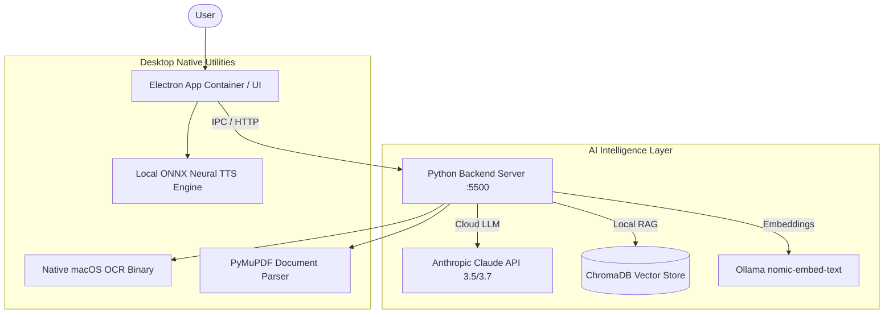

# 🤖 NextAI — Privacy-First Desktop AI Assistant & Knowledge Hub

[](LICENSE)
[](https://www.electronjs.org/)
[](https://www.python.org/)
[](https://www.anthropic.com/claude)
[](https://www.trychroma.com/)
[](https://github.com/aldisusanto/NextAI)

> **NextAI** is a smart, private, 24/7 personal AI assistant for macOS, Windows, and Linux. Powered by **Anthropic Claude**, local RAG (ChromaDB), native macOS OCR, PyMuPDF, and local ONNX Text-to-Speech.

---

## 🌟 Key Features

- **🤖 Powered by Anthropic Claude**: Seamless integration with `Claude 3.5 Sonnet`, `Claude 3.5 Haiku`, and `Claude Opus` for intelligent reasoning and multi-modal task execution.
- **🧠 Local RAG & Vector Knowledge Base**: Built-in **ChromaDB** vector database with **Ollama (`nomic-embed-text`)** embeddings for searching personal documents, PDFs, and notes offline.
- **👁️ Native Screen OCR**: Desktop vision integration (`mac_ocr`) for instant screen text extraction and intelligent context-aware assistance.
- **🗣️ Local Indonesian Text-to-Speech (TTS)**: Neural ONNX speech synthesis (`id_ID-news_tts-medium.onnx`) for natural offline voice responses.
- **📊 Cost Analytics & Token Tracker**: Real-time tracking of token consumption, savings, and API usage.
- **🔒 Privacy-First Architecture**: Your document index and vector embeddings stay strictly on your local disk (`.chroma_db`).

---

## 🛠️ System Architecture



---

## 🚀 Getting Started

### Prerequisites

- **Node.js** v18.0.0 or higher
- **Python** 3.10+
- **Electron** v35+
- _(Optional)_ **Ollama** (for local embeddings & local LLM fallback)

### Installation

1. **Clone the repository**:

   ```bash
   git clone https://github.com/aldisusanto/NextAI.git
   cd NextAI
   ```

2. **Install Node.js dependencies**:

   ```bash
   npm install
   ```

3. **Install Python requirements**:

   ```bash
   pip install chromadb requests pymupdf
   ```

4. **Start Python server & Electron app**:
   ```bash
   npm start
   ```

---

## 📦 Building Standalone App Packages

Build cross-platform desktop executables using `electron-builder`:

```bash
# Build for macOS
npm run build:mac

# Build for Windows
npm run build:win

# Build for Linux
npm run build:linux
```

---

## 📂 Project Structure

```text
NextAI/
├── electron-main.js         # Main Electron process container
├── preload.js               # IPC bridge script
├── server.py                # Python backend (ChromaDB RAG, PyMuPDF, OCR)
├── app.js                   # Main frontend logic & Claude API integration
├── .chroma_db/              # Local persistent vector database
├── mac_ocr                  # Native macOS optical character recognition binary
├── id_ID-news_tts-medium*   # ONNX Neural TTS model files
├── index.html               # Main chat interface
├── dashboard.html           # Analytics & token tracking page
├── datasources.html         # Document ingestion & knowledge base manager
├── settings.html            # Model selector & API key configuration
└── package.json             # Electron configuration & build scripts
```

---

## 📄 License

Distributed under the **MIT License**. See [`LICENSE`](LICENSE) for more information.

---

## 👨‍💻 Maintainer

Created with ❤️ by **Aldi Susanto** ([@aldisusanto](https://github.com/aldisusanto)).

- **GitHub**: [github.com/aldisusanto](https://github.com/aldisusanto)
- **Repository**: [github.com/aldisusanto/NextAI](https://github.com/aldisusanto/NextAI)
